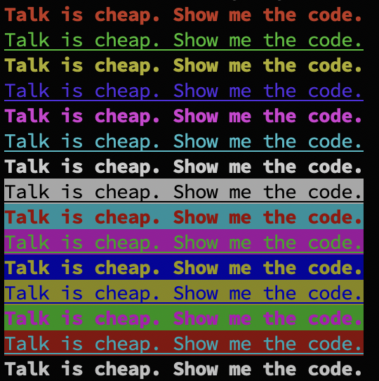

# highlight

Shell实现终端文本高亮输出工具

---

## 介绍

使用 `shell` 实现一个小工具，可以设置终端文本的文字颜色，背景颜色，粗体，下划线。

文本高亮需要调用 `tput` 命令，`tput` 命令通常包含在 `ncurses` 软件包中

可以通过以下命令安装：

```shell
# Debian/Ubuntu系统
sudo apt-get install ncurses-bin

# CentOS/RHEL系统中
sudo yum install ncurses
```

`Linux` 与 `Mac` 的 `getopt` 方法不一样，如果是 Mac 系统可以安装 `gnu-getopt` 来替换系统的 `getopt`

```shell
# 安装gnu-getopt
brew install gnu-getopt

# 加入到环境变量
export PATH="/opt/homebrew/opt/gnu-getopt/bin:$PATH"
```

---

## 使用说明

### 参数设定

`str` 输出到终端的文本

`color`  设置文本颜色

值 | 说明
--|--
0 | BLACK
1 | RED
2 | GREEN
3 | YELLOW
4 | BLUE
5 | PURPLE
6 | CYAN
7 | GREY

`bgcolor` 设置背景颜色

值 | 说明
--|--
0 | BLACK
1 | RED
2 | GREEN
3 | YELLOW
4 | BLUE
5 | PURPLE
6 | CYAN
7 | GREY

`bold` 设置粗体

值 | 说明
--|--
0 | 不设置粗体
1 | 粗体

`underline` 设置下划线

值 | 说明
--|--
0 | 不设置下划线
1 | 下划线

### 执行

```shell
./demo.sh
```

### 效果图


